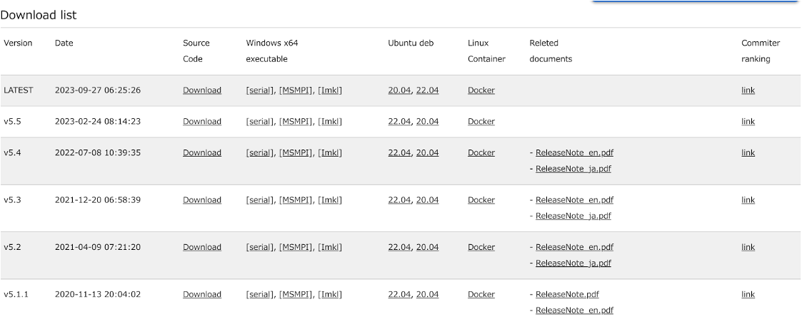

# FrontISTR CD/CI マニュアル

## 概要

GitLabを使用して、FrontISTRプロジェクトに対して包括的なCI/CD（継続的インテグレーションと継続的デリバリー）環境が構築されている。
この環境は、コードの変更ごとにソフトウェアのビルド、テスト、パッケージング、ドキュメント作成、そしてリリースまでの一連のプロセスを自動化している。
以下に、このCI/CD環境の概要を簡潔に説明する。

### ビルド環境の準備
<dl>
  <dt>Dockerイメージの作成と保管：</dt>
  <dd>GitLabのコンテナレジストリに、ビルド環境として利用される複数のDockerイメージが保存されている。
      これらのイメージは、異なるバージョンのUbuntuやライブラリを基盤とし、それぞれ到底のビルドタスクに適合するように構成されている。</dd>
</dl>

### CI/CDのフロー
<dl>
  <dt>ビルドステージ：</dt>
  <dd>コミットごとに、Dockerイメージを利用してプロジェクトのビルドが実行される。
      ビルド結果はアーティファクトとして保存され、後続のステージで利用される。</dd>
  <dt>テストステージ：</dt>
  <dd>ビルド結果に対して、様々なテストケールが実行される。
      これにより、変更がプロジェクトの安定性や互換性に影響を与えないことが確認される。</dd>
  <dt>ドキュメント生成：</dt>
  <dd>doxygenを利用し、APIドキュメントが自動生成される。
      これに加えて、マニュアルのリダイレクト設定も行われる。</dd>
  <dt>パッケージング：</dt>
  <dd>Debianパッケージ、Dockerコンテナ、Windowsバイナリが生成され、それぞれ適切な場所に保存される。</dd>
  <dt>デプロイ：</dt>
  <dd>上記のすべてのステージを経た後、成果物がGitLab Pagesを通じてWeb上に公開される。
      これにより、ユーザーは新しいバージョンのFrontISTRを容易に入手できる。</dd>
</dl>

### Webサーバーにおける定期更新
* Webサーバー上では、crondを利用して定期的にFrontISTRリポジトリがpullされ、新たなタグが存在すれば、パッケージングプロセスが実行される。
  これにより、ダウンロードリストも自動で更新される。

このようにして、FrontISTRの開発プロセス全体が、効率的で一貫性のある方法で、自動化されている。
これにより開発者はコードの品質向上に集中でき、ユーザーには安定したソフトウェアが提供される。

## gitlabでやっていることの詳細

### ビルド環境となるDockerイメージの保管
* イメージの作成、gitlabのコンテナレジストリへのpushは各Makefileでローカルから行える(pushにはDeveloper以上の権限が必要)。パッケージの更新があったときなどに限りたまにmakeすればよい。
  * docker/ci/Makefile
  * docker/binary/x86_64-w64-mingw32/Makefile
* 各イメージがCI/CDにおいてビルド環境として利用される。
* docker/ci
  * CIの中でのビルド環境となるDockerイメージを作成するためのディレクトリ
  * Makefile
    * make allでruntime, build, documentのDockerイメージがビルドされる
    * runtime と build は、{metis5(無印), metis4} と {ubuntu2004, ubuntu2204} の各組合せで、各4つのイメージを作成
  * Dockerfile.ubuntu2004
  * Dockerfile.ubuntu2204
    * 環境を構築するための手順が記載されている
    * libmumpsとlibtrilinos-mlのパッケージ名(バージョン番号)がubuntu2004とubuntu2204で異なるため、個別に用意されている
    * x86_64環境ではMKLをインストール、その他の環境ではOpenBLASをインストール
  * runtimeイメージ
    * fistr1, hecmw_part1などの実行時に必要な依存ライブラリのみをインストールしたubuntu環境
    * CIのdocker/fistr1の配布用イメージ作成に利用される
    * {metis5 & ubuntu2204} 以外は使われていない
  * buildイメージ
    * FrontISTRのビルドに必要なコンパイラ等の開発ツール、ライブラリ、へッダー等をインストールしたubuntu環境
    * runtimeイメージをベースとして、差分を追加インストールする形で作成される
    * CIのbuildやdocker/fistr1のビルド環境として利用される
  * build-metis4イメージ
    * buildでmetisをv4にしたもの
    * metis4のダウンロードURL([https://github.com/CIBC-Internal/metis-4.0.3.git](https://github.com/CIBC-Internal/metis-4.0.3.git))は非公式のものなので、リンク切れに注意
    * CIの中では使われていない
  * documentイメージ
    * doxygen実行用に必要なツールをインストールしたubuntu環境
* docker/binary/x86_64-w64-mingw32
  * Ubuntu上でWindowsバイナリをビルドするための、クロスコンパイル環境のDockerイメージを作成するためのディレクトリ
  * Makefile
    * serial と thread の共通イメージ (base:serial, base:thread) の作成
    * serial, thread, process, hybrid の各サブディレクトリでのmake
  * Dockerfile
    * 共通イメージの作成方法を記述
  * serial, thread
    * MPI並列なしの場合のビルド環境イメージ作成
    * {openblas, mkl} と {デフォルト, trilinosをv12にしたもの, metisをv4にしたもの} の各組合せで作成
  * process, hybrid
    * MPI並列ありの場合のビルド環境イメージ作成
    * {msmpi, impi} と {openblas, mkl} と {デフォルト, trilinosをv12にしたもの, metisをv4にしたもの} の各組合せについて作成
  * 作った全てのイメージを実際にCIの中で使っているわけではない。 実際に使われているのは以下の3つ：
    * thread:openblas
    * hybrid:msmpi_openblas
    * hybrid:impi_mkl
  * metis4のダウンロードURL([https://github.com/mfem/tpls/raw/gh-pages/metis-4.0.3.tar.gz](https://github.com/mfem/tpls/raw/gh-pages/metis-4.0.3.tar.gz))は非公式のものなので、リンク切れに注意

### コミットごとに実行されること
.gitlab-ci.yml に記述されている (全部で20分ぐらいかかる)

* 補足情報
  * artifacts で指定したパスは、そのジョブの成果物として保存される。
    * 参考: GitLab Docsの[Job artifactsに関する記述](https://docs.gitlab.com/ee/ci/jobs/job_artifacts.html)
      > Jobs downloads all artifacts from the completed jobs in previous stages by default.
  * needsで指定したジョブの artifacts は複製されて受け継がれる。
    * 参考：GitLab Docsの[needsに関する記述](https://docs.gitlab.com/ee/ci/yaml/?query=needs)
      > When a job uses needs, it no longer downloads all artifacts from previous stages by default,
      > because jobs with needs can start before earlier stages complete.
      > With needs you can only download artifacts from the jobs listed in the needs configuration.
* build
  * Dockerイメージ(build:ubuntu2004 or build:ubuntu2204) の中でmakeする。
    * build ディレクトリをアーティファクトとして残す。
  * build/{serial,openmp,mpi,hybrid}/{ubuntu2004,ubuntu2204} (4x2=8種類)
    * 以上8個のジョブを動かす。
    * それぞれ対応するdockerイメージを利用する。
* test
  * Dockerイメージ(build:ubuntu2004 or build:ubuntu2204) の中でテストを実施する。
  * test/serial/serial/{ubuntu2004,ubuntu2204} (2通り)
  * test/openmp/{serial,openmp}/{ubuntu2004,ubuntu2204} (4通り)
  * test/mpi/{serial,mpi}/{ubuntu2004,ubuntu2204} (4通り)
  * test/hybrid/{serial,openmp,mpi,hybrid}/{ubuntu2004,ubuntu2204} (8通り)
    * 以上18個のジョブを動かす。
    * それぞれ対応するdockerイメージを利用する。
    * needs で対応する build ジョブを指定している。
      * 対応する build ジョブのあとに実行される。
      * アーティファクトに build ステージの成果物があるのでそれを利用しテストを行う。
  * テストの詳細は[tests/README.ja.md](https://gitlab.com/FrontISTR-Commons/FrontISTR/-/blob/master/tests/README.ja.md?ref_type=heads)
* document
  * document
    * FrontISTR_manual のgitlab-ciで作られるものへのリダイレクトをアーティファクトの public/_redirects に書き出す。
      * FrontISTR_manualの方でも以下が行われている
        * ビルド環境Dockerイメージ作成
        * コミットごとのビルド(.gitlab-ci.yml)
    * ドキュメント管理についてFrontISTR_manual リポジトリへ移行しFrontISTR リポジトリでは何も行わないようになったため、形骸化している。
      * _redirects のコピーを行うだけなので、document:latest イメージを使う必要もない。
  * doxygen
    * APIドキュメントの生成
    * アーティファクトの public/doxygen ディレクトリに書き出す。
    * document:latest イメージを実行環境として使う。
    * [FrontISTR Documents](https://frontistr-commons.gitlab.io/FrontISTR/)
* package
  * Debian package, Docker container, Windows binary の生成を行う。
  * docker/fistr1
    * docker/container/Makefile を実行
      * docker/container/Dockerfile に基づいてdockerイメージをビルド、gitlabのコンテナレジストリへpush
    * [Docker が入った Docker イメージ](https://hub.docker.com/_/docker)を実行環境として使う。(Docker in Docker)
  * x86_64-w64-mingw32
    * registry.gitlab.com/frontistr-commons/frontistr/x86_64-w64-mingw32/thread, hybrid 等の Docker コンテナ内で Windows  用にクロスコンパイルする。
    * x86_64-w64-mingw32/thread-openblas
    * x86_64-w64-mingw32/hybrid-msmpi-openblas
    * x86_64-w64-mingw32/hybrid-impi-mkl_intelthread
      * 以上3つのジョブを動かす。
      * それぞれ対応するdockerイメージを利用する
      * 計3種類のzipファイルがアーティファクトの public/release/x86_64-w64xy-mingw32/ ディレクトリに保存される。
  * deb/{serial,openmp,mpi,hybrid}/{ubuntu2004,ubuntu2204}
    * 以上8個のジョブを動かす。
    * needs で対応する build ジョブを指定している。
      * ビルド結果を適宜利用している。
    * cpack により Debian package を作成する。計8種類のdebファイルがアーティファクトの public/release/deb ディレクトリに保存される。
  * 依存ライブラリ
    * docker/fistr1とx86_64-w64-mingw32の各3種については、次表のとおり。
      
* deploy
  * pages(masterブランチにおいてのみ実行)
    * document, packageにおける成果物(publicディレクトリ)をそのまま保持
      * document ステージで生成したリダイレクトや doxygen
      * package ステージで生成した Debian package や Windows binary
    * 古いリンクからのリダイレクトを public/_redirects に追記
    * gitlab-pagesの機能でpublicディレクトリが永続化され、中身がwebに公開される

全ブランチの全コミットについて build, test, document, package ステージが実行される。
計算資源の節約のために build, test ステージまでとすることも可能である。
ただすべてのステージを実行しても20分程度しかかかっていないので今は最後まで実行しても問題ないかもしれない。
将来的にコード量やビルドのターゲットが増えた場合、変更を検討する必要がある。

## web server でやっていることの詳細
* crondにて、一定時間おきにFrontISTRレポジトリをpullし、vA.B.C.D形式の新たなタグがあれば上の package と同じプロセスが実行される。
  * .gitlab-ci.ymlでやっていることをBashスクリプトでやっている感じ。
* [ダウンロードページ](https://www.frontistr.com/download/) のダウンロードリストも同様に作成している。
  

## 確認したいこと
* webサーバの[Downloadページ](https://www.frontistr.com/download/)の修正について
  * [Ubuntu debのダウンロードリンクが誤っている](https://gitlab.com/FrontISTR-Commons/FrontISTR/-/issues/560)
* Githubへのミラーのタイミング
  * [参考](https://docs.gitlab.com/ee/user/project/repository/mirror/)
* Windows版でMKLをリンクする際に難しかったことは？
* Windows用ビルド環境イメージは、全てを使っているわけではない？
* Webサーバー上にあるCDのスクリプトはバージョン管理している？
* GitLab CIでの成果物をWebサーバーで流用できない？
  * パラメータを変えたいと思ったときにGitLab CIとWebサーバーの両方で作業をする必要があり、大変
* Webサーバでやっていることに「Push built container to Gitlab Registry」とあるが、本当？ なぜ？
* 変更した場合のテスト方法は？
* Webサーバにログインできるのは誰？どの範囲でアカウントを共有してよい？

## 解読用の参考リンク集
* GitLab CI/CD パイプライン設定リファレンス
  * [.gitlab-ci.ymlキーワードリファレンス](https://gitlab-docs.creationline.com/ee/ci/yaml/)
  * [CI/CD YAML syntax reference](https://docs.gitlab.com/ee/ci/yaml/)
* [Dockerfile リファレンス 書式](https://docs.docker.jp/engine/reference/builder.html#builder-format)
* [コンテナレジストリー](https://gitlab.com/FrontISTR-Commons/FrontISTR/container_registry)
* [Intel MPI Compilation Command Options -echo -show -show_env](https://www.intel.com/content/www/us/en/docs/mpi-library/developer-reference-linux/2021-8/compilation-command-options.html#GUID-6C61B7A6-3074-4CA9-ACA3-58CFD15A8437)
* [How to compile and run a simple MS-MPI program](https://learn.microsoft.com/ja-jp/archive/blogs/windowshpc/how-to-compile-and-run-a-simple-ms-mpi-program)
